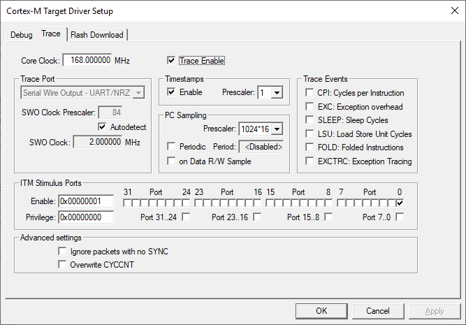

# How to get STM32 trace via SWO working?

## Keil
For Keil it is actually fairly simple as you need to [Write a small callback routine](http://www.keil.com/support/man/docs/jlink/jlink_trace_itm_viewer.htm) and correctly setup STLink. Then everytime you will call printf(), it will be visible in Trace window during debugging

