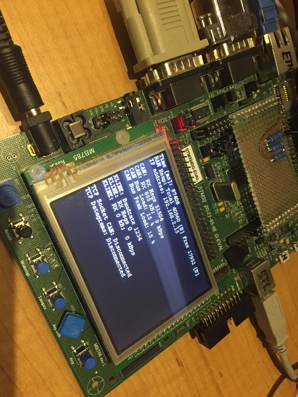

# STM3240G-EVAL
Base code for TCP Server code was copied from [https://github.com/STMicroelectronics/STM32CubeF4](https://github.com/STMicroelectronics/STM32CubeF4)

TCP Server is then extended with:
 * CAN driver. Implemented on `CAN2 RX @ PB5`
 * UART (KLINE) drivers. Implemented on `UART3 RX @ PB11`
 * Passive protocols `ISO14230`, `KW1281`, `ISO15765`, `VWTP2.0`
 * Wireshark RAW protocol TCP packet formatter
 * Wireshark SocketCAN protocol TCP packet formatter
 * Device statistics on LCD

## Wireshark and STM3240G-EVAL setup
**Dependency:** Used development kit [STM32F40G-EVAL](https://www.st.com/en/evaluation-tools/stm3240g-eval.html) from STMicroelectronics
How to setup Wireshark to work with the development kit  

 * Compile and upload firmware or upload precompiled firmware `STM324xG_EVAL.hex` in release.
 * Start Wireshark using `wireshark -k -i TCP@127.0.0.1:19000` for Datagram tracing or `wireshark -k -i TCP@127.0.0.1:19001` for SocketCAN tracing. Obviously instead of `127.0.0.1` you will use IP address of used monitor.
 * Copy scripts into Wireshark LUA script folder `Help -> About -> Folders -> Personal Lua Plugins`
 * If you want to further develop those scripts, use something like `mklink /J "C:\Path\To\AppData\Roaming\Wireshark\plugins" "D:\Git\Monitor\Plugins"`
 * You can also load coloring rules via `View -> Coloring Rules -> Import`

## How it looks

