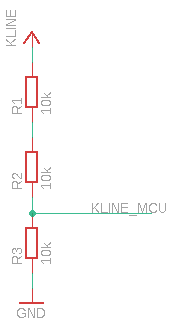

# Passive KLINE

Simple divider intended to be connected on FT232, TeensyLC, Arduino, STM32, ...

KLINE is operating with cca 12V range, so with 30k of resistor divider, you will get 4V / 600uA, which should be digestable for all 3V3 systems.

